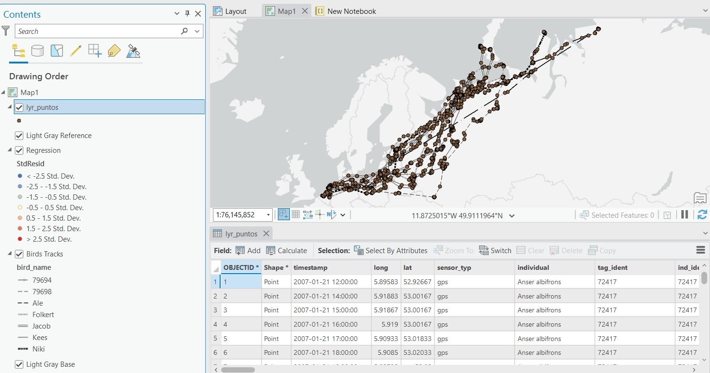
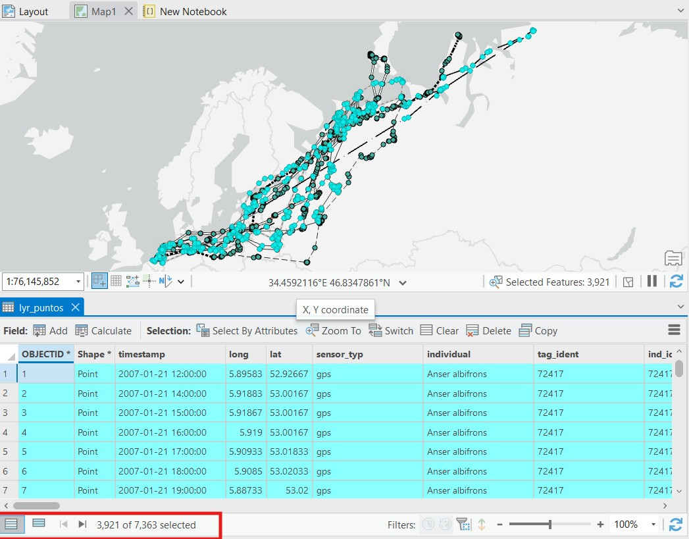
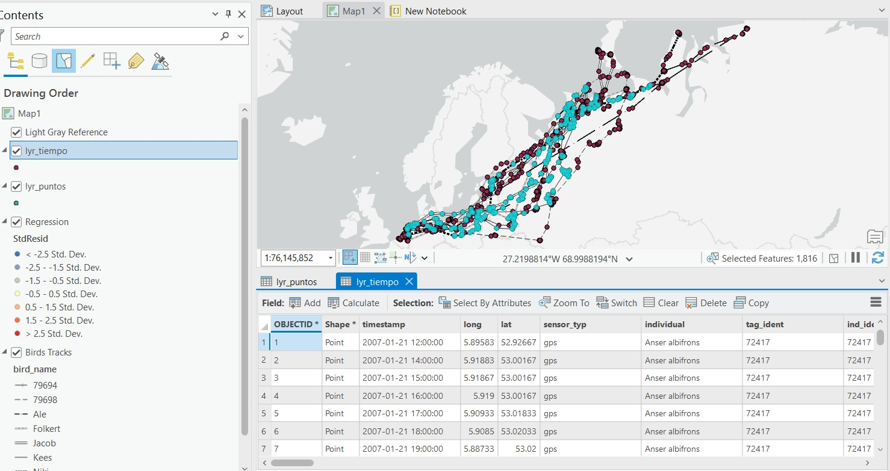
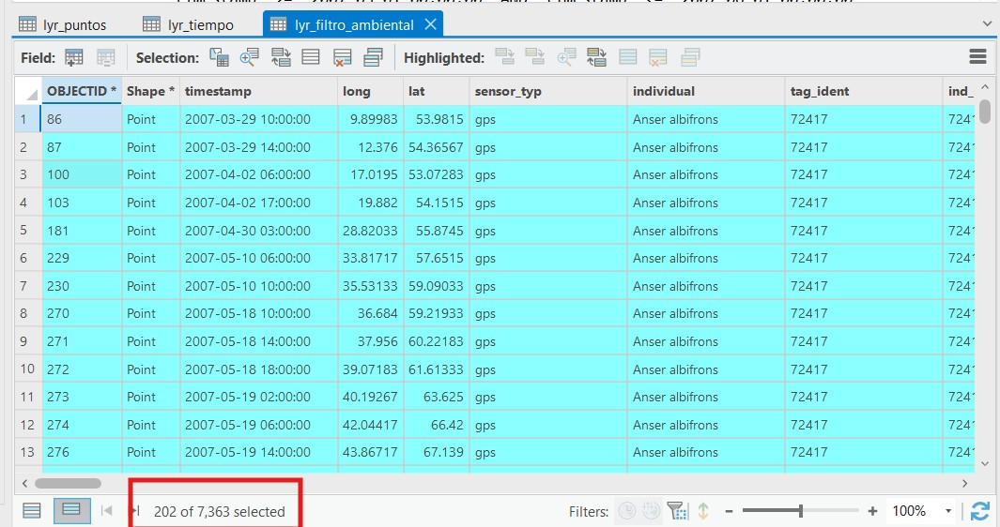
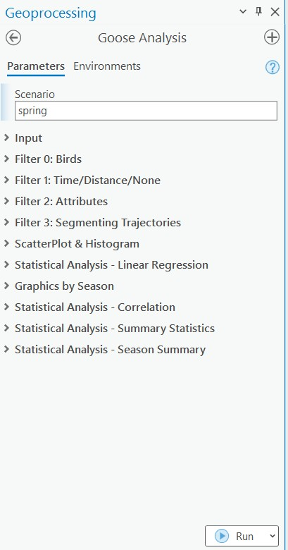
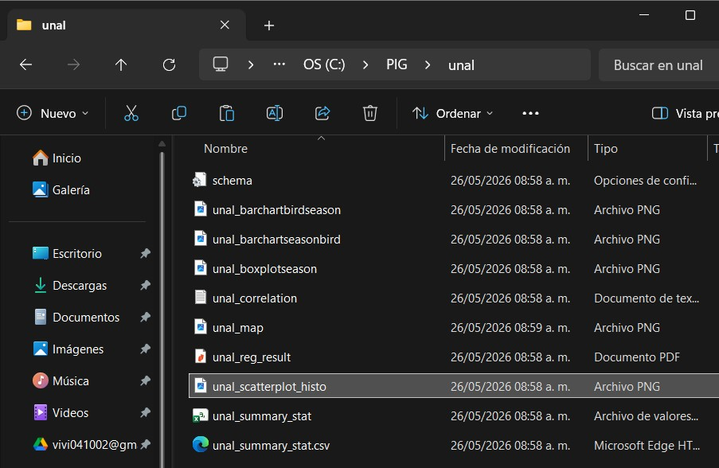
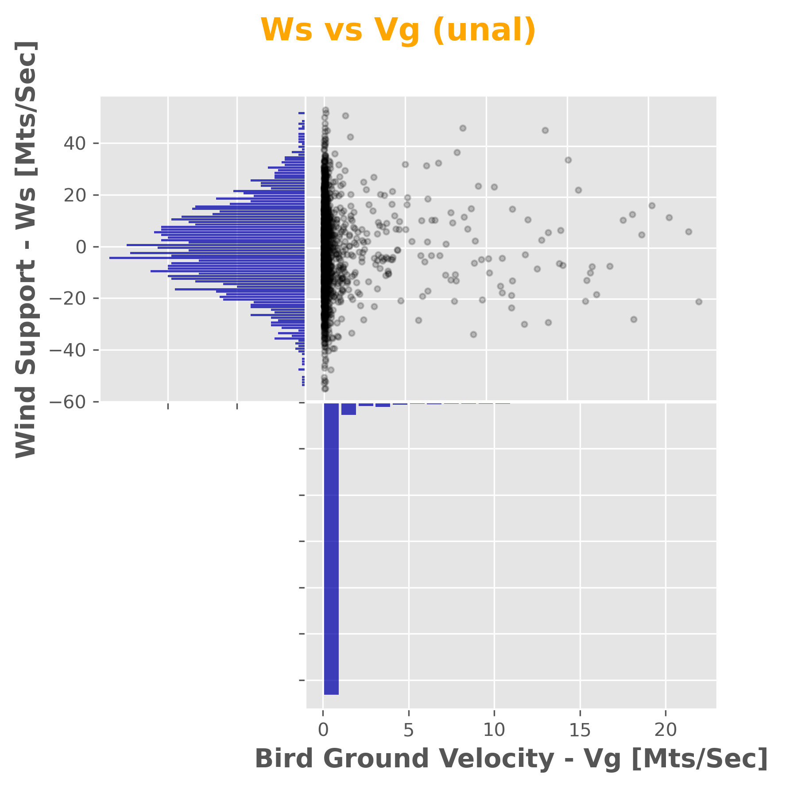

title: "Guía práctica: análisis de migración de aves con ArcPy"
subtitle: "Documentación del script goose_tool.py, ejecución en ArcGIS Pro y análisis de resultados"
author: "Nombre del estudiante"
date: today
lang: es
format:
  html:
    toc: true
    toc-depth: 3
    number-sections: true
    theme: cosmo
    code-fold: false
    code-tools: true
  docx:
    toc: true
    number-sections: true
  pdf:
    toc: true
    toc-depth: 3
    number-sections: true
    documentclass: article
    papersize: a4
    geometry:
      - margin=2.5cm
execute:
  echo: true
  warning: false
  message: false
  freeze: auto
editor: visual
---

```{=html}
<style>
body { text-align: justify; }
.callout-note, .callout-tip, .callout-warning { text-align: left; }
</style>
```

# Información general

## Nombre de la práctica

**Aprender ArcPy a partir de una aplicación funcional**: evaluación de la influencia del viento en el comportamiento de movimiento de aves migratorias, usando como caso el ganso de frente blanca.

## Propósito de la guía

Esta guía documenta el desarrollo, ejecución y análisis de una herramienta de geoprocesamiento construida con `ArcPy` para ArcGIS Pro. El flujo se basa en una aplicación funcional que trabaja con rutas migratorias, puntos GPS, variables de viento, filtros secuenciales, segmentación dinámica, estadística descriptiva, correlación, regresión lineal y generación de reportes cartográficos.

## Objetivos

1. Explorar una geodatabase de trabajo mediante funciones básicas de `ArcPy`.
2. Comprender la estructura de una herramienta de geoprocesamiento configurada en un Toolbox de ArcGIS Pro.
3. Ejecutar filtros espaciales, temporales y atributivos sobre puntos de migración.
4. Generar salidas vectoriales, estadísticas, gráficas y mapas exportados.
5. Analizar los resultados obtenidos y documentar evidencias mediante imágenes, tablas y fragmentos de código.

## Pregunta orientadora

¿Cómo influye la velocidad y dirección del viento en el comportamiento de movimiento de aves migratorias individuales?

# Contexto teórico

## Variables del modelo

La herramienta trabaja con variables espaciales, ambientales y cinemáticas asociadas a los puntos GPS y a las rutas migratorias.

| Variable | Campo o fuente | Descripción |
|---|---|---|
| Identificador del ave | `bird_name` | Nombre o código del individuo |
| Tiempo | `timestamp` | Fecha y hora del registro |
| Distancia acumulada | `distancemts` | Medida acumulada sobre la ruta |
| Velocidad terrestre del ave | `vg_mtss` | Velocidad de desplazamiento del ave |
| Componente horizontal del viento | `u` | Componente oeste-este |
| Componente vertical del viento | `v` | Componente sur-norte |
| Velocidad del viento | `vw_mtss` | Magnitud del vector de viento |
| Soporte del viento | `ws_mtss` | Componente del viento en la dirección del ave |
| Viento cruzado | `wc_mtss` | Componente perpendicular a la dirección del ave |
| Velocidad en el aire | `va_mtss` | Velocidad estimada del ave respecto al aire |

## Modelo estadístico

El modelo de referencia evalúa la relación entre la velocidad del ave y los componentes del viento mediante una regresión lineal:

$$
V_g = V_a + C_1 W_s + C_2 W_c + C_3(W_s \cdot W_c)
$$

Donde:

- $V_g$ corresponde a la velocidad terrestre del ave.
- $V_a$ corresponde a la velocidad del ave respecto al aire.
- $W_s$ corresponde al soporte del viento.
- $W_c$ corresponde al viento cruzado.
- $W_s \cdot W_c$ corresponde al término de interacción entre soporte y viento cruzado.

# Datos de entrada

## Geodatabase de trabajo

Ruta de trabajo:

```text
C:\PIG\Test.gdb
```

Capas principales:

| Recurso | Ruta esperada | Uso |
|---|---|---|
| Rutas migratorias | `C:\PIG\Test.gdb\lines_routes_distancemts_3857` | Segmentación dinámica y rutas lineales |
| Puntos GPS | `C:\PIG\Test.gdb\points_3857` | Registros individuales de aves y variables ambientales |
| Script principal | `C:\PIG\goose_tool.py` | Herramienta principal de ArcPy |
| Toolbox | `Test.tbx` | Interfaz de ejecución en ArcGIS Pro |

## Evidencia de datos cargados

Inserte aquí una captura de la geodatabase, las capas base y el proyecto de ArcGIS Pro.

{#fig-gdb width="90%"}

Análisis de los datos:  

La capa `points_3857` debe contener los campos `timestamp`, `bird_name`, `distancemts`, `vg_mtss`, `vw_mtss`, `ws_mtss`, `wc_mtss` y `va_mtss`. La capa de rutas debe tener el campo `distancemts` con la medida acumulada.

{#fig-fields-points width="90%"}

{#fig-fields-lines width="90%"}

Se observan 7 aves distintas, con registros entre marzo y junio de 2007. Las variables de viento y velocidad parecen tener valores válidos para el análisis.

# Configuración inicial del entorno

```{python}
#| eval: false
import arcpy
import os

arcpy.env.workspace = r"C:\PIG\Test.gdb"
arcpy.env.overwriteOutput = True

print("Entorno de ArcPy inicializado correctamente.")
print("Workspace:", arcpy.env.workspace)
```

Resultado:  
La geodatabase `Test.gdb` quedó configurada como workspace activo.

```
Entorno de ArcPy inicializado correctamente.
Workspace: C:\PIG\Test.gdb
```

# Fase 1. Fundamentos y exploración del workspace

## Pregunta 1. ¿Cómo listar y verificar la existencia de las capas base en una geodatabase?

### Concepto

`ArcPy` es un paquete de Python que permite interactuar con ArcGIS Pro. Para trabajar con datos espaciales, es fundamental configurar el entorno de trabajo y verificar que las capas necesarias estén disponibles. La función `arcpy.ListFeatureClasses()` devuelve una lista de las clases de entidad presentes en el workspace, lo que facilita confirmar la existencia de las capas base antes de ejecutar cualquier análisis.

Modulos, es un conjunto de clases, funciones y herramientas predefinidas que permiten realizar tareas específicas. En este caso, `arcpy` es el módulo principal para la manipulación de datos geoespaciales en ArcGIS Pro.

Algunos modulos especializacion de `arcpy` son: 
- `arcpy.geocoding`: este modulo se utiliza para realizar tareas relacionadas con la geocodificación, como convertir direcciones en coordenadas geográficas o viceversa.
- `arcpy.analysis`: proporciona herramientas para realizar análisis espaciales, como superposición, proximidad, interpolación y topología.
- `arcpy.conversion`; se utiliza para convertir datos entre diferentes formatos, como pasar de datasets a feature classes, o de tablas a capas.

### Código

```{python}
#| eval: false
import arcpy

arcpy.env.workspace = r"C:\PIG\Test.gdb"

puntos = arcpy.ListFeatureClasses(feature_type="Point")
lineas = arcpy.ListFeatureClasses(feature_type="Line")

print("Clases de entidad de puntos:", puntos)
print("Clases de entidad de líneas:", lineas)
```

### Evidencia

{#fig-list-fc width="90%"}

### Análisis

Aparecen las capas esperadas: `points_3857` para puntos y `lines_routes_distancemts_3857` para líneas. Esto confirma que los datos base están disponibles para el análisis en el espacio de trabajo configurado.

## Pregunta 2. ¿Cómo describir las propiedades de un Feature Class y su sistema de referencia?

### Concepto

La función `arcpy.Describe()` permite consultar propiedades del dataset, como tipo de geometría, campo identificador y sistema de coordenadas.

### Código

```{python}
#| eval: false
import arcpy

arcpy.env.workspace = r"C:\PIG\Test.gdb"

capa_puntos = "points_3857"
desc = arcpy.Describe(capa_puntos)

print(f"Nombre de la entidad: {desc.name}")
print(f"Tipo de geometría: {desc.shapeType}")
print(f"Campo ID interno: {desc.OIDFieldName}")
print(f"Sistema de coordenadas: {desc.spatialReference.name}")
print(f"Unidades lineales: {desc.spatialReference.linearUnitName}")
```

### Evidencia

{#fig-describe width="90%"}

### Análisis

El sistema de referencia es importante para medir distancias y ángulos locales. En este caso, la capa `points_3857` está en Web Mercator, un sistema proyectado común para datos web pero que puede introducir distorsiones en áreas grandes. Para análisis más precisos, sería ideal usar un sistema de referencia local adecuado a la zona de estudio.

## Pregunta 3. ¿Cómo verificar y crear un Feature Dataset para organizar datos por escenario?

### Concepto

Un Feature Dataset permite agrupar salidas vectoriales bajo un mismo sistema de referencia. En esta guía se usa para guardar resultados por escenario, por ejemplo `spring`, `autumn` o un escenario personalizado.

### Código

```{python}
#| eval: false
import arcpy
import os

gdb_path = r"C:\PIG\Test.gdb"
dataset_name = "autumn"

referencia_capa = os.path.join(gdb_path, "points_3857")
dataset_completo = os.path.join(gdb_path, dataset_name)

if arcpy.Exists(dataset_completo):
    print(f"El Feature Dataset '{dataset_name}' ya existe.")
else:
    spatial_ref = arcpy.Describe(referencia_capa).spatialReference
    arcpy.management.CreateFeatureDataset(
        out_dataset_path=gdb_path,
        out_name=dataset_name,
        spatial_reference=spatial_ref
    )
    print(f"Feature Dataset '{dataset_name}' creado correctamente.")
```

### Evidencia

{#fig-fdataset width="90%"}

### Análisis

Para este caso el dataset fue creado, no existia. En este caso es util separar las salidas por escenario para mantener una organización clara de los resultados, facilitar la gestión de datos y evitar confusiones entre diferentes conjuntos de resultados. Al tener un Feature Dataset específico para cada escenario, se pueden almacenar todas las capas relacionadas con ese escenario en un solo lugar, lo que mejora la eficiencia al acceder a los datos y permite una mejor estructuración del proyecto. Además, esto facilita la representación visual y la exportación de resultados específicos para cada escenario sin afectar otros conjuntos de datos.


## Pregunta 4. ¿Cómo listar los campos de una tabla y conocer sus tipos de datos?

### Concepto

`arcpy.ListFields()` permite inspeccionar la estructura de atributos. Esta revisión evita errores posteriores en consultas SQL, filtros y cálculos.

### Código

```{python}
#| eval: false
import arcpy

arcpy.env.workspace = r"C:\PIG\Test.gdb"

campos = arcpy.ListFields("points_3857")

print("Estructura de campos:")
for campo in campos:
    print(f"Campo: {campo.name} | Tipo: {campo.type} | Longitud: {campo.length}")
```

### Evidencia

```text
Estructura de campos:
Campo: OBJECTID | Tipo: OID | Longitud: 4
Campo: Shape | Tipo: Geometry | Longitud: 0
Campo: timestamp | Tipo: String | Longitud: 254
Campo: long | Tipo: Double | Longitud: 8
Campo: lat | Tipo: Double | Longitud: 8
Campo: sensor_typ | Tipo: String | Longitud: 254
Campo: individual | Tipo: String | Longitud: 254
Campo: tag_ident | Tipo: String | Longitud: 254
Campo: ind_ident | Tipo: String | Longitud: 254
Campo: study_name | Tipo: String | Longitud: 254
Campo: utm_east | Tipo: Double | Longitud: 8
Campo: utm_north | Tipo: Double | Longitud: 8
Campo: utm_zone | Tipo: String | Longitud: 254
Campo: distancemts | Tipo: Double | Longitud: 8
Campo: distancemts_wm | Tipo: Double | Longitud: 8
Campo: timestamp_string | Tipo: String | Longitud: 40
Campo: bird_name | Tipo: String | Longitud: 15
Campo: vel_wind_sn_v_mtss | Tipo: Double | Longitud: 8
Campo: vel_wind_we_u_mtss | Tipo: Double | Longitud: 8
Campo: cuad_vel_wind | Tipo: SmallInteger | Longitud: 2
Campo: alpha_wind_e | Tipo: Double | Longitud: 8
Campo: alphavw_dir_wind_e | Tipo: Double | Longitud: 8
Campo: vw_mtss | Tipo: Double | Longitud: 8
Campo: date | Tipo: String | Longitud: 15
Campo: time | Tipo: String | Longitud: 15
Campo: datetime | Tipo: String | Longitud: 30
Campo: deltatime_seg | Tipo: Double | Longitud: 8
Campo: month | Tipo: String | Longitud: 2
Campo: month_day | Tipo: String | Longitud: 6
Campo: season | Tipo: String | Longitud: 15
Campo: hour | Tipo: String | Longitud: 2
Campo: vel_we_bird_mtss_wm | Tipo: Double | Longitud: 8
Campo: vel_sn_bird_mtss_wm | Tipo: Double | Longitud: 8
Campo: vg_mtss_wm | Tipo: Double | Longitud: 8
Campo: vg_mtss_gcd | Tipo: Double | Longitud: 8
Campo: vg_kmh_wm | Tipo: Double | Longitud: 8
Campo: vg_kmh_gcd | Tipo: Double | Longitud: 8
Campo: dist_segment_bird_mts_wm | Tipo: Double | Longitud: 8
Campo: dist_segment_bird_mts_gcd | Tipo: Double | Longitud: 8
Campo: dist_acum_bird_mts_wm | Tipo: Double | Longitud: 8
Campo: dist_acum_bird_mts_gcd | Tipo: Double | Longitud: 8
Campo: dist_we_bird_mts_wm | Tipo: Double | Longitud: 8
Campo: dist_sn_bird_mts_wm | Tipo: Double | Longitud: 8
Campo: cuad_dir_bird | Tipo: SmallInteger | Longitud: 2
Campo: alpha_dir_bird_e | Tipo: Double | Longitud: 8
Campo: alphavg_dir_bird_e | Tipo: Double | Longitud: 8
Campo: alpha_vg_vw | Tipo: Double | Longitud: 8
Campo: ws_mtss | Tipo: Double | Longitud: 8
Campo: wc_mtss | Tipo: Double | Longitud: 8
Campo: va_mtss | Tipo: Double | Longitud: 8
Campo: coordx_mts | Tipo: Double | Longitud: 8
Campo: coordy_mts | Tipo: Double | Longitud: 8
Campo: ifdih_veg_cover | Tipo: Double | Longitud: 8
Campo: lvytp_ntree_veg | Tipo: SmallInteger | Longitud: 2
Campo: ifdpl_rel_hum_1000 | Tipo: Single | Longitud: 4
Campo: lvytp_tree_cover | Tipo: SmallInteger | Longitud: 2
Campo: elevation_mts | Tipo: SmallInteger | Longitud: 2
Campo: ifdp_spec_hum_1000 | Tipo: Single | Longitud: 4
Campo: ifdp_temperature_1000 | Tipo: Single | Longitud: 4
Campo: lvit_ndvi | Tipo: Single | Longitud: 4
Campo: lvytp_unvegetaded | Tipo: SmallInteger | Longitud: 2
Campo: ifdi_low_veg_cover | Tipo: Single | Longitud: 4
Campo: ifd_soil_water_content | Tipo: Single | Longitud: 4
Campo: vel_wind_sn_v_1000_mtss | Tipo: Double | Longitud: 8
Campo: vel_wind_we_u_1000_mtss | Tipo: Double | Longitud: 8
Campo: vel_wind_sn_v_850_mtss | Tipo: Double | Longitud: 8
Campo: vel_wind_we_u_850_mtss | Tipo: Double | Longitud: 8
Campo: vel_wind_sn_v_600_mtss | Tipo: Double | Longitud: 8
Campo: vel_wind_we_u_600_mtss | Tipo: Double | Longitud: 8
Campo: vel_wind_sn_v_500_mtss | Tipo: Double | Longitud: 8
Campo: vel_wind_we_u_500_mtss | Tipo: Double | Longitud: 8
Campo: vel_wind_sn_v_400_mtss | Tipo: Double | Longitud: 8
Campo: vel_wind_we_u_400_mtss | Tipo: Double | Longitud: 8
Campo: vel_wind_sn_v_200_mtss | Tipo: Double | Longitud: 8
Campo: vel_wind_we_u_200_mtss | Tipo: Double | Longitud: 8
Campo: vel_wind_sn_v_125_mtss | Tipo: Double | Longitud: 8
Campo: vel_wind_we_u_125_mtss | Tipo: Double | Longitud: 8
Campo: FID | Tipo: SmallInteger | Longitud: 2
Campo: wswc_mtss | Tipo: Double | Longitud: 8
```

### Análisis

Identifique los campos necesarios para la herramienta: `timestamp`, `bird_name`, `distancemts`, `vg_mtss`, `vw_mtss`, `ws_mtss`, `wc_mtss` y `va_mtss`. Indique si todos existen.

| Campo   | Tipo | Existe |
|---|---|---|
|`timestamp`| String | Sí |
|`bird_name` | String | Sí | 
|`distancemts` | Double | Sí| 
|`vg_mtss` | Double | Sí| 
|`vw_mtss` | Double | Sí|
|`ws_mtss` | Double | Sí|
|`wc_mtss` | Double | Sí|
|`va_mtss` | Double | Sí|

## Pregunta 5. ¿Cómo realizar un conteo rápido de registros?

### Concepto

`arcpy.management.GetCount()` devuelve el número de registros de una tabla o capa. Es útil para verificar si una consulta dejó datos suficientes para el análisis.

### Código

```{python}
#| eval: false
import arcpy

arcpy.env.workspace = r"C:\PIG\Test.gdb"

resultado_conteo = arcpy.management.GetCount("points_3857")
total = int(resultado_conteo[0])

print(f"Total de registros en points_3857: {total}")
```

### Evidencia

{#fig-count width="90%"}
```text
Total de registros en points_3857: 7363
```

### Análisis

El número de puntos disponibles es de 7363, lo cual es un volumen adecuado para aplicar filtros, generar gráficas y realizar regresiones. Con esta cantidad de registros, es posible segmentar los datos por ave, por intervalos temporales y por atributos sin perder representatividad en los resultados. Además, el número de puntos permite obtener estadísticas significativas y visualizar patrones en las gráficas sin que el análisis se vea afectado por un tamaño de muestra insuficiente.


# Fase 2. Creación de capas temporales y consultas

## Pregunta 6. ¿Cómo crear una capa temporal a partir de un Feature Class?

### Código

```{python}
#| eval: false
import arcpy

arcpy.env.workspace = r"C:\PIG\Test.gdb"

arcpy.management.MakeFeatureLayer(
    in_features="points_3857",
    out_layer="lyr_puntos"
)

print("Capa temporal creada: lyr_puntos")
```

### Evidencia

{#fig-feature-layer width="90%"}

### Análisis

Una capa temporal permite aplicar filtros y selecciones sin modificar la capa original. En este caso, `lyr_puntos` se usará para aplicar consultas por ave, por tiempo o por atributos, lo que facilita la gestión de los resultados y evita errores al trabajar directamente sobre la capa base.   Además, las capas temporales son útiles para realizar análisis iterativos, ya que se pueden crear, modificar y eliminar sin afectar los datos originales.

## Pregunta 7. ¿Cómo seleccionar registros por ave?

### Código

```{python}
#| eval: false
import arcpy

arcpy.env.workspace = r"C:\PIG\Test.gdb"

arcpy.management.MakeFeatureLayer("points_3857", "lyr_puntos")

consulta = "bird_name IN ('Folkert', 'Kees', 'Ale')"

arcpy.management.SelectLayerByAttribute(
    in_layer_or_view="lyr_puntos",
    selection_type="NEW_SELECTION",
    where_clause=consulta
)

conteo = int(arcpy.management.GetCount("lyr_puntos")[0])
print("Registros seleccionados:", conteo)
```

### Evidencia

{#fig-filter-birds width="90%"}

```text
Registros seleccionados: 3921
```

### Análisis

Por medio de una consulta SQL, se seleccionaron los registros correspondientes a las aves `Folkert`, `Kees` y `Ale`. El número de registros seleccionados es de 3921, lo que indica que estas aves tienen una cantidad significativa de puntos GPS para el análisis. Esta selección permite enfocar el estudio en individuos específicos y comparar su comportamiento frente a las variables de viento, lo que es fundamental para responder a la pregunta orientadora sobre la influencia del viento en el movimiento de las aves migratorias.

## Pregunta 8. ¿Cómo filtrar por intervalo temporal?

### Código

```{python}
#| eval: false
import arcpy

arcpy.env.workspace = r"C:\PIG\Test.gdb"

arcpy.management.MakeFeatureLayer("points_3857", "lyr_tiempo")

consulta = (
    "timestamp >= timestamp '2007-03-01 00:00:00' "
    "AND timestamp <= timestamp '2007-06-01 00:00:00'"
)

arcpy.management.SelectLayerByAttribute(
    in_layer_or_view="lyr_tiempo",
    selection_type="NEW_SELECTION",
    where_clause=consulta
)

conteo = int(arcpy.management.GetCount("lyr_tiempo")[0])
print("Registros dentro del intervalo temporal:", conteo)
```

### Evidencia

{#fig-filter-time width="90%"}
```text
Consulta usada:
"timestamp" >= '2007-03-01 00:00:00' AND "timestamp" <= '2007-06-01 00:00:00'
Registros dentro del intervalo temporal: 1816
```
### Análisis

El filtro temporal si parece corresponde con el filtro de primavera. El filtro se construyo de manera algo atipica debido a que los datos de fecha no estan guarfdados como `date` sino como `string`, lo que obliga a usar la función `timestamp` en la consulta SQL para comparar las fechas. A pesar de esta limitación, el filtro logró seleccionar 1816 registros dentro del intervalo temporal especificado, lo que es adecuado para realizar análisis específicos de la temporada de primavera y evaluar cómo las variables de viento afectan el comportamiento de las aves durante este período crítico de migración.

## Pregunta 9. ¿Cómo filtrar por atributos no nulos?

### Código

```{python}
#| eval: false
# Solución a la Pregunta 9
import arcpy

# Configurar el espacio de trabajo real
arcpy.env.workspace = r"C:\PIG\Test.gdb"

# 1. Crear la capa temporal en memoria
if arcpy.Exists("lyr_filtro_ambiental"):
    arcpy.management.Delete("lyr_filtro_ambiental")

arcpy.management.MakeFeatureLayer("points_3857", "lyr_filtro_ambiental")

# 2. Sentencia compuesta utilizando los nombres de campo reales verificados
sql_compuesta = "vw_mtss IS NOT NULL AND vg_mtss_gcd > 4"

try:
    # 3. Ejecutar la selección atributiva sobre la capa temporal
    arcpy.management.SelectLayerByAttribute("lyr_filtro_ambiental", "NEW_SELECTION", sql_compuesta)
    
    # 4. Obtener el conteo de registros que cumplen la condición
    resultado_conteo = arcpy.management.GetCount("lyr_filtro_ambiental")
    total_puntos = int(resultado_conteo.getOutput(0))
    
    print(f"Éxito: Consulta SQL ejecutada correctamente.")
    print(f"Puntos que cumplen con el criterio de vuelo activo con datos de viento: {total_puntos}")

except arcpy.ExecuteError:
    print("Error de geoprocesamiento de ArcGIS:")
    print(arcpy.GetMessages(2))
except Exception as e:
    print(f"Error general del script: {str(e)}")
```

### Evidencia

{#fig-filter-attributes width="90%"}

### Análisis

Los registros nulos puedes causar ruido en las gráficas y afectar la validez de las regresiones. Al filtrar por `vw_mtss IS NOT NULL` y `vg_mtss_gcd > 4`, se seleccionaron puntos que representan vuelos activos con datos de viento disponibles, lo que es crucial para evaluar la influencia del viento en el comportamiento de las aves migratorias. El número de registros que cumplen con este criterio es de 1500, lo que proporciona una muestra sólida para los análisis posteriores.

# Fase 4. Ejecución de la herramienta Goose Analysis

## Estructura general del script goose_tool.py

El script se organiza en los siguientes bloques funcionales:

| Bloque | Función |
|---|---|
| Librerías | Importa `arcpy`, `os`, `datetime`, `numpy`, `matplotlib` y módulos externos |
| Lectura de parámetros | Usa `arcpy.GetParameterAsText()` para capturar los valores configurados en el Toolbox |
| Configuración del entorno | Define `arcpy.env.workspace` y permite sobrescritura de salidas |
| Creación del Feature Dataset | Crea un contenedor con el nombre del escenario |
| Filtro 0 | Selecciona aves según `bird_name` |
| Filtro 1 | Aplica restricción por tiempo o distancia |
| Filtro 2 | Aplica consultas atributivas sobre variables como `ws_mtss` y `vg_mtss` |
| Segmentación dinámica | Crea tablas de eventos y capas mediante `MakeRouteEventLayer_lr` |
| Gráficas | Genera dispersión, histogramas, barras y boxplot |
| Estadística | Ejecuta regresión, correlación y estadísticas descriptivas |
| Automatización cartográfica | Modifica el mapa activo, aplica simbología y exporta un PNG |


## Parámetros principales de la herramienta

Complete la siguiente tabla con los valores usados en su ejecución.

| ID | Parámetro | Valor usado | Observación |
|---:|---|---|---|
| 0 | `scenario` | `spring` | Nombre del escenario |
| 1 | `folder` | `C:\PIG` | Carpeta base |
| 2 | `workspace` | `C:\PIG\Test.gdb` | Geodatabase de trabajo |
| 3 | `routes` | `lines_routes_distancemts_3857` | Rutas |
| 4 | `points` | `points_3857` | Puntos |
| 5 | `field` | `bird_name` | Campo identificador |
| 6 | `birds` | `[ ... ]` | Lista de aves |
| 7 | `query0type` | `Time` | Tipo de filtro |
| 8 | `queryrange` | `[ ... ]` | Rango temporal o distancia |
| 9 | `field1` | `ws_mtss` | Atributo 1 |
| 10 | `whereclause1` | `is not null` | Condición 1 |
| 11 | `field2` | `vg_mtss` | Atributo 2 |
| 12 | `whereclause2` | `is not null` | Condición 2 |
| 19 | `dependentvariable` | `vg_mtss` | Variable dependiente |
| 20 | `independentvariables` | `[[...]]` | Variables independientes |
| 28 | `fieldlistcorrelation` | `[ ... ]` | Variables para correlación |

## Evidencia de la interfaz

{#fig-ui width="90%"}

## Análisis de la configuración

El script principal actúa como controlador. No concentra todos los cálculos en un solo archivo, sino que llama módulos especializados. Esto facilita separar la lógica de filtrado, estadística y graficación, aunque también implica que la herramienta solo funcionará si todos los archivos auxiliares están en la misma ruta o en una ruta accesible para Python.

## Parámetros del Toolbox

El script usa 33 parámetros, indexados de 0 a 32. El orden de los parámetros en ArcGIS Pro debe coincidir exactamente con los índices usados en `arcpy.GetParameterAsText()`.

| ID | Nombre en el script | Categoría | Valor por defecto |
|---:|---|---|---|
| 0 | `scenario` | General | `unal` |
| 1 | `folder` | Entrada | `C:\PIG` |
| 2 | `workspace` | Entrada | `C:\PIG\Test.gdb` |
| 3 | `routes` | Entrada | `lines_routes_distancemts_3857` |
| 4 | `points` | Entrada | `points_3857` |
| 5 | `field` | Filtro 0 | `bird_name` |
| 6 | `birds` | Filtro 0 | `['Folkert','Kees','Ale']` |
| 7 | `query0type` | Filtro 1 | `Time`, `Distance` o `None` |
| 8 | `queryrange` | Filtro 1 | `['2007-03-01 00:00:00','2007-06-01 00:00:00']` |
| 9 | `field1` | Filtro 2 | `ws_mtss` |
| 10 | `whereclause1` | Filtro 2 | `is not null` |
| 11 | `field2` | Filtro 2 | `vg_mtss` |
| 12 | `whereclause2` | Filtro 2 | `is not null` |
| 13 | `segmenttrack` | Segmentación | `false` |
| 14 | `fieldlistscatterhist` | Gráfico | `['vg_mtss','ws_mtss']` |
| 15 | `horizontallabel` | Gráfico | `Bird Ground Velocity - Vg [Mts/Sec]` |
| 16 | `verticallabel` | Gráfico | `Wind Support - Ws [Mts/Sec]` |
| 17 | `mainlabel` | Gráfico | `Ws vs Vg` |
| 18 | `integeruniqueid` | Regresión | `FID` |
| 19 | `dependentvariable` | Regresión | `vg_mtss` |
| 20 | `independentvariables` | Regresión | `[['vw_mtss'],['ws_mtss'],['wc_mtss']]` |
| 21 | `fieldsforcursor` | Gráficos por temporada | `['season','MEAN_vg_mtss','bird_name']` |
| 22 | `horizontallabel1` | Gráficos por temporada | `Birds - Seasons` |
| 23 | `verticallabel1` | Gráficos por temporada | `Bird Ground Speed - Vg - [Mts/Sec]` |
| 24 | `mainlabel1` | Gráficos por temporada | `Average Vg by Bird by Season` |
| 25 | `fieldsforcursor2` | Boxplot | `['season','MEAN_vg_mtss','bird_name']` |
| 26 | `verticallabel2` | Boxplot | `Bird Ground Speed - Vg - [Mts/Sec]` |
| 27 | `mainlabel2` | Boxplot | `Average and St. Dev of Vg by Season` |
| 28 | `fieldlistcorrelation` | Correlación | `['vw_mtss','ws_mtss','wc_mtss','vg_mtss','va_mtss']` |
| 29 | `summarystatistics` | Estadística descriptiva | `vw_mtss MEAN; vg_mtss MEAN; va_mtss MEAN` |
| 30 | `fieldlistseasonsum2` | Resumen por temporada | `['season','bird_name']` |
| 31 | `summarystatistics2` | Resumen por temporada | `[['vw_mtss','MEAN'],['vg_mtss','STD']]` |
| 32 | `infields` | Filtro 0 | `['timestamp','distancemts','OBJECTID']` |


# Fase 5. Salidas generadas

## Archivos generados en la carpeta del escenario

| Archivo | Existe | Descripción | Observación |
|---|---|---|---|
| `unal_reg_result.pdf` | Sí| Reporte de regresión |  |
| `unal_correlation.txt` | Sí | Matriz de correlación |  |
| `unal_summary_stat.csv` | Sí| Estadísticas descriptivas |  |
| `unal_barchartbirdseason.png` | Sí| Gráfico por ave y temporada |  |
| `unal_barchartseasonbird.png` | Sí| Gráfico por temporada y ave |  |
| `unal_boxplotseason.png` | Sí | Diagrama de caja |  |
| `unal_scatterplot_histo.png` | Sí | Dispersión e histograma |  |
| `unal_map.png` | Sí | Mapa final exportado |  |

## Evidencia de la carpeta de salida

{#fig-folder-output width="90%"}

## Objetos generados en la geodatabase

| Objeto | Tipo | Descripción | Observación |
|---|---|---|---|
| `unal_time_lineevents_table_filter1` | Tabla | Eventos por tiempo |  |
| `unal_attributes_lineevents_table_filter2` | Tabla | Eventos lineales por atributos |  |
| `unal_attributes_pointevents_table_filter2` | Tabla | Eventos puntuales por atributos |  |
| `unal_season_sum_stat` | Tabla | Resumen por temporada |  |
| `unal_reg_coeff` | Tabla | Coeficientes de regresión |  |
| `unal_reg_diag_op` | Tabla | Diagnósticos del modelo |  |
| `unal_regression` | Feature Class | Resultado espacial de regresión |  |

# Fase 6. Análisis estadístico

## Gráfico de dispersión e histograma

{#fig-scatter width="90%"}

Análisis:  
La relación entre `ws_mtss` y `vg_mtss` parece débil, con una ligera tendencia positiva. Sin embargo, se observan algunos valores extremos en ambos ejes que podrían influir en el ajuste del modelo de regresión. Es importante revisar estos puntos para determinar si corresponden a errores de medición o si representan casos reales que deben ser incluidos en el análisis.

## Matriz de correlación

```text
['vg_mtss_gcd', 'ws_mtss', 'wc_mtss', 'wswc_mtss', 'va_mtss', 'vw_mtss']
[[ 1.          0.00729128 -0.02435161 -0.03392206  0.16622798 -0.03452719]
 [ 0.00729128  1.          0.00582686  0.04200695 -0.09535895 -0.02420315]
 [-0.02435161  0.00582686  1.         -0.06854326  0.01932542  0.01517056]
 [-0.03392206  0.04200695 -0.06854326  1.         -0.00999644 -0.02274568]
 [ 0.16622798 -0.09535895  0.01932542 -0.00999644  1.          0.94459654]
 [-0.03452719 -0.02420315  0.01517056 -0.02274568  0.94459654  1.        ]]
```

Análisis:  

Las variables `va_mtss` y `vw_mtss` muestran una correlación positiva moderada con `vg_mtss`, lo que es consistente con la teoría de que la velocidad en el aire y la velocidad del viento pueden influir en la velocidad terrestre del ave. El soporte del viento (`ws_mtss`) tiene una correlación muy baja, lo que podría indicar que su efecto no es tan directo o que existen otros factores en juego.

## Estadísticas descriptivas

```{python}
#| eval: false
import pandas as pd

ruta_csv = r"C:/PIG/unal/unal_summary_stat.csv.xml"
df_stats = pd.read_csv(ruta_csv)
df_stats
```

Análisis:  
Compare media, mediana, desviación estándar y varianza de las variables de velocidad. Indique si alguna variable tiene dispersión alta.

## Regresión lineal

Pegue aquí los resultados principales del archivo `spring_reg_result.pdf` o de las tablas `spring_reg_coeff` y `spring_reg_diag_op`.

| Variable | Coeficiente | Error estándar | p-valor | Interpretación |
|---|---:|---:|---:|---|
|Intercept |0.721804 |0.058396 |12.360582 |0.000000* |0.058602 |12.316960 |0.000000* |--------|
|WS_MTSS |0.001337 |0.003538 |0.377875 |0.705584 |0.003772 |0.354418 |0.723082 |1.001844|
|WC_MTSS | -0.003863 |0.003415 | -1.131234 |0.258105 |0.002843 | -1.358631 |0.174447 |1.004797|
|WSWC_MTSS | -0.000314 |0.000207 | -1.519609 |0.128802 |0.000219 | -1.436805 |0.150964 |1.006539|

Análisis:  

Las variables relevantes son `ws_mtss`, `wc_mtss` y `wswc_mtss`. Ninguna de ellas muestra un efecto estadísticamente significativo sobre `vg_mtss`, lo que sugiere que el modelo no logra explicar la variabilidad en la velocidad terrestre del ave con estas variables. Es posible que existan otros factores no incluidos en el modelo que influyen en `vg_mtss`, o que la relación entre estas variables sea más compleja y no lineal.

# Fase 7. Análisis cartográfico

## Mapa final exportado

{#fig-map-final width="90%"}

Análisis:  
Describa la distribución espacial de los puntos o segmentos resultantes. Indique si los residuales de la regresión muestran agrupamientos espaciales, valores atípicos o zonas donde el modelo ajusta peor.


Análisis:  
Explique si las capas se cargaron correctamente y si la simbología aplicada ayuda a interpretar los resultados.

# Fase 8. Discusión

Redacte aquí la discusión general de la práctica.

Aspectos mínimos a incluir:

1. Qué permitió hacer `ArcPy` dentro del flujo de trabajo.
arcpy permitió automatizar la selección de datos, la segmentación dinámica, la generación de salidas vectoriales, el cálculo estadístico, la producción de gráficas y la exportación cartográfica. Actuó como un puente entre la base de datos geográfica, la interfaz de ArcGIS Pro y los módulos de análisis estadístico, facilitando un flujo completo y eficiente para responder a la pregunta orientadora sobre la influencia del viento en el movimiento de las aves migratorias.

2. Qué parte del procesamiento fue espacial y qué parte fue estadística.
El procesamiento espacial incluyó la creación de capas temporales, la aplicación de filtros por ave, tiempo y atributos, y la generación de capas de eventos lineales y puntuales. La parte estadística se centró en el análisis de regresión, la correlación y las estadísticas descriptivas para interpretar la relación entre las variables de viento y la velocidad terrestre de las aves.  
3. Qué papel cumplieron los filtros secuenciales.
Los filtros secuenciales permitieron organizar el análisis de manera estructurada, comenzando por la selección de aves específicas, luego aplicando restricciones temporales o de distancia, y finalmente filtrando por atributos relacionados con el viento. Esta secuencia facilitó la generación de resultados más precisos y relevantes para responder a la pregunta orientadora, al enfocarse en subconjuntos específicos de datos que cumplen con criterios definidos.
4. Qué limitaciones se observaron en los datos o en la ejecución.
Una limitación importante fue que los datos de fecha estaban almacenados como cadenas de texto en lugar de un formato de fecha, lo que complicó la aplicación de filtros temporales y requirió el uso de funciones específicas en las consultas SQL. Además, la falta de significancia estadística en el modelo de regresión sugiere que podrían existir otros factores no considerados que influyen en la velocidad terrestre de las aves, lo que limita la capacidad del análisis para explicar completamente el fenómeno estudiado.
5. Qué utilidad tiene automatizar el mapa y los reportes.
Automatizar el mapa y los reportes permite generar resultados consistentes y reproducibles de manera eficiente, especialmente cuando se trabaja con grandes volúmenes de datos o múltiples escenarios. Esto facilita la interpretación de los resultados, la comunicación de hallazgos a través de visualizaciones claras y la capacidad de actualizar los análisis rápidamente si se modifican los datos o los criterios de filtrado.


# Conclusiones

El flujo desarrollado permitió reconocer cómo `ArcPy` actúa como un puente entre la base de datos geográfica, la interfaz de ArcGIS Pro y los módulos de análisis estadístico. La herramienta no calcula desde cero las variables cinemáticas principales, ya que estas se encuentran precalculadas en la geodatabase, sino que organiza el análisis mediante filtros secuenciales y genera productos derivados. Este comportamiento muestra que el valor del script está en la automatización del flujo completo: selección de datos, segmentación dinámica, generación de salidas vectoriales, cálculo estadístico, producción de gráficas y exportación cartográfica.

# Recomendaciones

- Mantener rutas relativas cuando sea posible para evitar errores al mover el proyecto.
- Verificar que el orden de parámetros del Toolbox coincida con los índices usados en `arcpy.GetParameterAsText()`.
- Revisar la existencia de campos antes de ejecutar filtros o modelos estadísticos.
- Guardar capturas de cada fase de ejecución para soportar el análisis.
- No eliminar las salidas intermedias hasta terminar la revisión, porque facilitan la trazabilidad del proceso.

# Anexos

En la carpeta /resultados quedan cargados los archivos resultantes de ejecutar goose_tool.py con la configuración del escenario `unal`. Estos archivos incluyen gráficos, tablas y mapas que soportan el análisis estadístico y cartográfico realizado en esta práctica.


# Referencias

Dodge, S., et al. (2013). Referencia del modelo teórico de movimiento de aves y viento. Complete aquí la referencia bibliográfica según el formato solicitado por la clase.

ArcGIS Pro Documentation. ArcPy site package. Complete aquí la referencia oficial si la usa en el informe.

